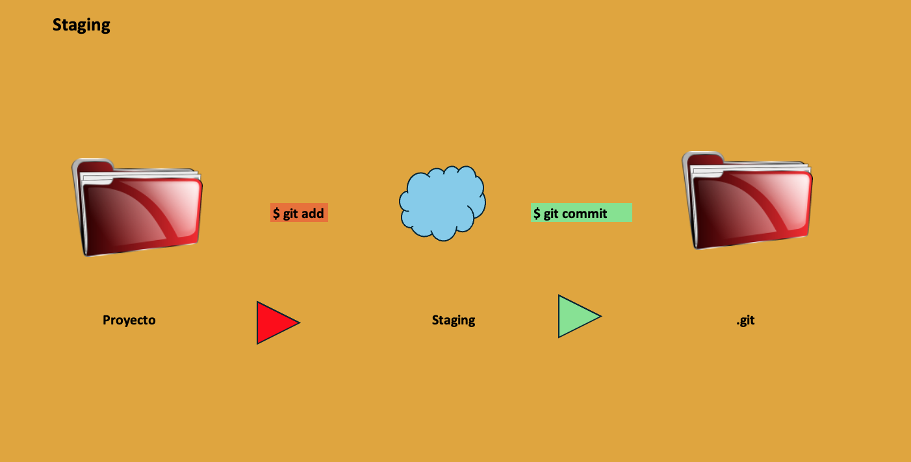
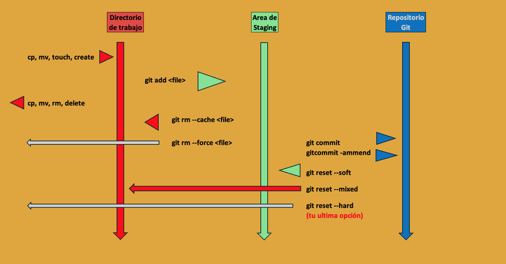

# Comandos Básicos de **git**

Veamos que hay en el directorio actual.

```bash
ls -a # listemos el directorio actual
```

Inicialización de control de versión de la siguiente forma:

```bash
git init # inicia el repositorio
```

creamos y agregamos un archivo nuevo al repositorio.

```bash
vim test.txt
git add test.txt
```

Para hacer el 'commit' del repo.

```bash
git commit -m "nuevo archivo"
```

La imagen muestra la transición en ```git add``` y ```git commit```


Para manejar multiples archivo en git (agregarlos 'add')

```bash
$ git add .
 
```

De esta manera agrega todos los archivo no agregados previamente. 

Con los siguientes comandos checaremos el estado ```status``` del repositorio y los ```commits``` realizados - la historia de nuestro repositorio.

```git status```

```bash
$ git status
On branch main
Your branch is up to date with 'origin/main'.

nothing to commit, working tree clean
```

```git log```

```bash
$ git log
commit a1b2c3d4e5f67890abcdef1234567890abcdef12 (HEAD -> main, origin/main)
Author: Juan Pérez <juan.perez@example.com>
Date:   Fri Apr 12 10:34:56 2025 -0700

    Corrige bug en función de validación de datos

commit 1234567890abcdef1234567890abcdef12345678
Author: Juan Pérez <juan.perez@example.com>
Date:   Thu Apr 11 17:20:31 2025 -0700

    Añade función para procesar CSVs de comisión por broker

commit 9f8e7d6c5b4a3a2b1c0d9e8f7a6b5c4d3e2f1a0b
Author: Juan Pérez <juan.perez@example.com>
Date:   Wed Apr 10 09:12:11 2025 -0700

    Inicializa repositorio con script base
```



## Conclusión

Los direfentes staging del flujo del control de versión - algunos del los comandos se veran en los siguientes capitulos.

---
[Contenido](README.md)
