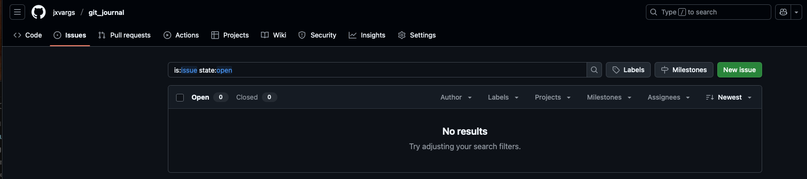

# Para crear una plantilla de issues en [GitHub](https://github.com)

---

Guía rápida para crear issues en GitHub

1. Ve al repositorio en GitHub.
2. Haz clic en la pestaña Issues.
3. Haz clic en New issue.
4. Llena el título y descripción del problema.
5. Opcionalmente, asigna etiquetas, personas, o proyectos.
6. Haz clic en Submit new issue.

---
---


---
---

📁 Crea la estructura de carpetas

En la raíz del repositorio, crea esta ruta:

```bash
# .github/ISSUE_TEMPLATE/

~$ mkdir -p .github/ISSUE_TEMPLATE/
```

📝 Crea un archivo de plantilla **MARKDOWN**

```bash
~$ .github/ISSUE_TEMPLATE/bug_report.md
```

🧩 Agrega el template:

```bash
---
name: 🐛 Reportar un Bug
about: Reporta un error en el proyecto
title: "[BUG] "
labels: bug
assignees: ''

---

**Describe el bug**
Explica claramente el error.

**Pasos para reproducir**
1. ...
2. ...
3. ...

**Resultado esperado**
...

**Información adicional**
...
```
