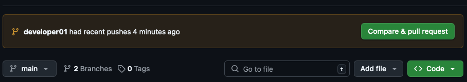

# Uso de Pull Request en [GitHub](https://github.com) - Colaboración Efectiva

Evitar cambios directos en la rama principal es una buena práctica porque protege el código estable de errores accidentales. Al trabajar con ramas y usar pull requests, se fomenta la revisión de código entre miembros del equipo antes de integrarlo, lo que mejora la calidad del software. Además, esta estrategia mantiene un historial limpio y organizado del proyecto, separando claramente el desarrollo del código en producción. También permite implementar integración continua (CI), asegurando que solo se despliegue código que ha sido validado y probado. Finalmente, mejora la colaboración, ya que facilita que varias personas trabajen en paralelo sin conflictos sobre la base principal del código.


Crea una rama nueva.

```bash
~$ git checkout -b developer01
~$ git branch
* developer01
  main
~$ vim README.md

 # miPrimerRepo
  2 My first repository - practice
  3 
  4 Mi primer contribucion local para GitHub
  5 
  6 Un commit mas desde GitHub - hola a todos! 😎
  7 
  8 Una nueva actualización mas para demostrar - git fetch
  9 
 10 Cambios desde mi rama local llamada developer01 # nueva linea

# ESC -> :wq

$ git status

En la rama developer01
Cambios no preparados para el commit:
  (usa "git add <archivo>" para actualizar lo que se incluirá en el commit)
  (usa "git restore <archivo>" para descartar los cambios en el directorio de trabajo)
  modificado:   README.md

Archivos sin seguimiento:
  (usa "git add <archivo>" para incluirlo en lo que se va a confirmar)
  nuevo_archivo.txt

no hay nada agregado al commit pero hay archivos sin seguimiento (usa "git add" para hacerles seguimiento)
```

Agregamos los cambios con las siguientes dos opciones:

```bash
~$ git commit -am "Cambios desde developer01"
```

> **NOTA:** El comando: git commit -am "Cambios desde developer01" hace dos cosas:
    1. `-a`: añade automáticamente todos los archivos modificados y rastreados (tracked) al área de staging.
    2. `-m`: "...": añade un mensaje de commit.
    ⚠ Importante: No incluye archivos nuevos (untracked). Para eso, necesitas usar `git add` archivo antes.

Sincronicemos nuestros cambios `developer01` con el repositorio remoto:

```bash
~$ $ git push origin developer01
Enumerating objects: 5, done.
Counting objects: 100% (5/5), done.
Delta compression using up to 8 threads
Compressing objects: 100% (3/3), done.
Writing objects: 100% (3/3), 412 bytes | 412.00 KiB/s, done.
Total 3 (delta 2), reused 0 (delta 0), pack-reused 0
remote: Resolving deltas: 100% (2/2), completed with 2 local objects.
remote: 
remote: Create a pull request for 'developer01' on GitHub by visiting:
remote:      https://github.com/usuario/repositorio/pull/new/developer01
remote: 
To github.com:usuario/repositorio.git
 * [new branch]      developer01 -> developer01
 ```

 Asi es como se muestra en [GitHub](https://github.com) despues de mandar los cambios.
 

Al refrescar la pagina podras ver que en el TAB -> `Branches`la rama `developer01` ya es parte del repositorio. despues de esto haz click en el boton `campare & pull request` espera la revision de tu companero de equipo para la revisión de cambios y aceptar el `request - > merge`

 [Contenido](README.md)
